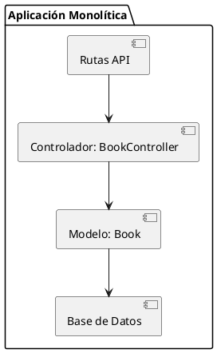

# Documentación Técnica: Implementación Monolítica
## 1. Introducción
Esta documentación describe la implementación monolítica de la funcionalidad clave del sistema desarrollado en el Primer Parcial. La funcionalidad seleccionada es la **gestión de libros**, que incluye operaciones CRUD y acciones específicas como "prestar" y "devolver" libros.
La versión monolítica del sistema está desarrollada en Laravel, utilizando principios de arquitectura hexagonal para una mejor separación de responsabilidades. Sin embargo, sigue siendo una aplicación monolítica en el sentido de que todo el sistema se despliega y ejecuta como una única unidad: lógica de negocio, acceso a datos y servidor web están empaquetados en una sola aplicación
## 2. Descripción de la Funcionalidad
La funcionalidad permite:
- Listar todos los libros.
- Ver detalles de un libro específico.
- Crear, actualizar y eliminar libros.
- Marcar un libro como prestado.
- Registrar la devolución de un libro.
### Rutas Definidas
Las rutas están definidas en el archivo `routes/api.php`:
```php
Route::get('/books', [BookController::class, 'index']);
Route::get('/books/{id}', [BookController::class, 'show']);
Route::post('/books', [BookController::class, 'store']);
Route::put('/books/{id}', [BookController::class, 'update']);
Route::delete('/books/{id}', [BookController::class, 'destroy']);
Route::patch('/books/{id}/borrow', [BookController::class, 'borrow']);
Route::patch('/books/{id}/return', [BookController::class, 'return']);
```
## 3. Arquitectura
La implementación sigue el patrón **Modelo-Vista-Controlador (MVC)**, característico de Laravel.
### Diagrama de Arquitectura


### Componentes Principales
- **Controlador (`BookController`)**: Maneja las solicitudes HTTP y coordina la lógica de negocio.
- **Modelo (`Book`)**: Representa la entidad "Libro" y gestiona la interacción con la base de datos.
- **Base de Datos**: Almacena la información de los libros.
## 4. Ejecución Local
### Requisitos
- PHP 8.1 o superior.
- Composer.
- Base de datos MySQL o SQLite.
### Pasos para Ejecutar
1. Clonar el repositorio:
   ```bash
   git clone https://github.com/alexisirala/Hexagonal-library.git
   cd Hexagonal-library
   ```
2. Instalar dependencias:
   ```bash
   composer install
   ```
3. Configurar el archivo `.env`:
   ```env
   DB_CONNECTION=sqlite
   DB_DATABASE=/ruta/a/database.sqlite
   ```
4. Ejecutar migraciones:
   ```bash
   php artisan migrate
   ```
5. Iniciar el servidor:
   ```bash
   php artisan serve
   ```
6. Acceder a la aplicación en `http://localhost:8000`.
## 5. Pruebas
Se han implementado pruebas funcionales en la carpeta `tests/Feature` para validar las operaciones CRUD y las acciones específicas de "prestar" y "devolver" libros.
### Ejecución de Pruebas
```bash
php artisan test
```
## 6. Capturas de Pantalla
### Listado de Libros

### Detalle de un Libro

## 7. Conclusión
La implementación monolítica cumple con los requisitos establecidos, proporcionando una funcionalidad completa y modularizada para la gestión de libros. La estructura MVC asegura claridad y mantenibilidad del código.